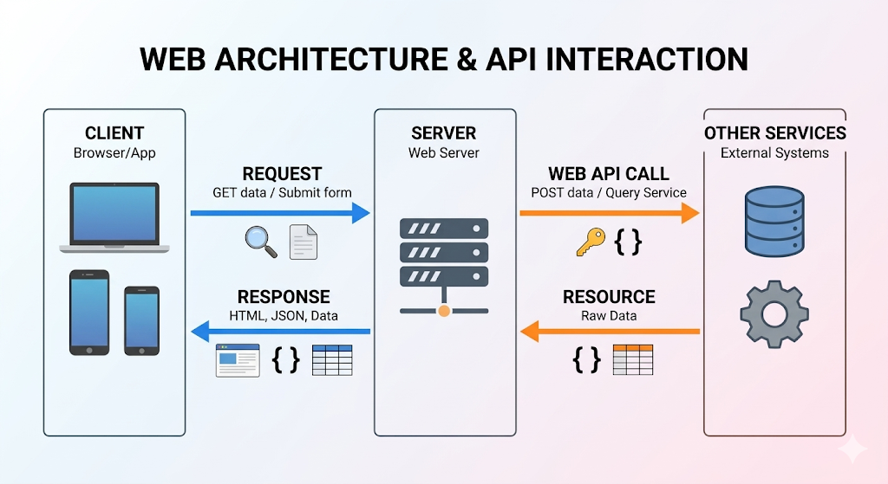

# Fundamentals of Web

Before diving into *Web Hacking*, I think we should know how the web works, right? Yeah, this is the reason for this chapter!

## How does the internet work?

### Client-Server Model

The internet has two main components: the **`Client`** and the **`Server`**. You can easily understand them like this:

* The `Server` provides resources and services.
* The `Client` uses those resources and services from the server!

When the `Client` needs to use resources or services from the `Server`, it sends a **`request`** to the server. The `Server` then provides the requested resources via a **`response`** after receiving the `request` from the client.


**Illustration (by Gemini)**

Do you think the Server can only send static resources (like a file that the Client can download and use)? Yeah, in the past, maybe! But now, with Web APIs, the server can interact with other services to provide you with much more functionality. However, at its core, the response still only returns data, nothing else!!

### Browser

The web pages you interact with every day are nothing more than a collection of data. At their core, they are just files, text files, image files, and so on. But what sits between you (the user) and the raw server data to create that beautiful web page you see? The **`browser`**!

The browser acts as the ultimate middleman. The server sends specific files—like HTML, CSS, and JS. The browser parses those resources and renders them into a visual, interactive interface. Of course, to generate those files dynamically, the server also relies on backend logic written in PHP or any other web programming language behind the scenes!

### DNS

> **How do the Client and Server know where to find each other?**

Every device connected to the internet has a unique **`IP (Internet Protocol)`** address, such as `123.45.67.89` (this is IPv4). The newer version is IPv6, for example, `22aa:cb7b:89cc::d23d:ee`. But IP addresses are hard for humans to remember, so Domain Names and the Domain Name System (DNS) come in!

You already know Domain Names like `abc.xyz.org` or `example.com`. These are much easier for humans to remember than an IPv4 or IPv6 address! But devices don't understand them directly. DNS is the middleman between humans and devices. You type a Domain Name, your computer sends a request to the DNS, and the DNS translates that domain name into an IP address so your device knows exactly where to connect!

### Internet Ports and Protocols

> **Do the Server and Client only use one connection for everything?**

No! A single server can host many different services at the same time: web pages, emails, file transfers, etc. But why don't we just use one single connection for all of them?

Imagine if you used the exact same connection to ask for a web page and to download a heavy PDF file at the same time. How would the server know which data belongs to which request? How would your computer know how to read the response?

This is where **`Ports`** and **`Protocols`** come in. Think of a **`Port`** as a specific "door" on the server dedicated to a specific task. For example, Port 80 is for regular web pages, Port 443 is for secure web pages, and Port 21 is for file transfers (FTP).

At each of these doors, the client and server agree to speak a different **`Protocol`** (a set of rules for communication). This is the key! It explains how a single server can handle multiple types of data and tasks at the same time without mixing them up!

## HTTP

**HyperText Transfer Protocol (HTTP)** is the set of rules that specifies how the Server and Client interact with each other! When a Client sends a request, this is an *HTTP request*. The format of this request follows HTTP rules, so the Server will respond via HTTP! The default port for transmitting HTTP is TCP port 80, while the HTTPS (S for Secure) port is **443**. HTTPS encapsulates HTTP within a TLS/SSL (Transport Layer Security / Secure Sockets Layer) tunnel.

HTTP is a **stateless** protocol, which means that two requests do not have any relation to each other. For example, when you send a login request with a username and password, and then you send a request to the home page, the web server processes each request individually. So, when you load the home page after logging in, the server actually doesn't know you logged in! This is why mechanisms like **Cookies** are used to remember you. Why do I use this example? Because we usually think, *"Oh, I logged in, so the server knows me and gives me a different page!"* But natively, HTTP has the memory of a goldfish!

### Request and Response with HTTP

You know, HTTP is the set of rules for how to communicate, right? So let's discuss these "rules" of HTTP!

#### Request

For example, when you go to the web page `abc.xyz` in your browser, the request in *HTTP Format* looks like this:

```HTTP
GET / HTTP/1.1
Host: www.abc.xyz
User-Agent: Mozilla/5.0 (X11; Linux x86_64) AppleWebKit/537.36 (KHTML, like Gecko) Chrome/145.0.0.0 Safari/537.36
Referer: https://google.com
```

But why and how do we know this? You can open your Browser's DevTools, go to the Network tab, try visiting `abc.xyz`, and look for the first request. It usually has a `Host` and a `User-Agent`. `Host` defines where you want to go, and `Agent` defines what you are using (Bot or Human browser). Yeah, but let's not get too bogged down on that right now!

The **`Method`** in an HTTP request is *how* you interact with the web server: `GET`, `POST`, `PATCH`, `DELETE`, etc. But in the real world, `GET` and `POST` are the two core request methods you will always work with.

* **`GET`** is mostly used to get information, get a web page, or retrieve something from the server.
* **`POST`** is mostly used to send data to the server, like submitting a form or sending data (like JSON) that the server can receive.

> **But** remember, these are just names to distinguish types of requests. How the server *processes* them is what's truly important! A developer can code a server to say: *"If someone sends me a POST request, I will return a web page. And I will only use GET for updating usernames."* So, we can technically use various methods for many purposes, even if it breaks standard conventions!

In an HTTP Request, you almost always need **`Headers`**. They provide extra information so the server can respond more specifically. Some Headers you will always see are: `Host`, `Content-Type`, `Content-Length`, `User-Agent`, and `Referer`. They are formatted like this: `Header-Name: Value`.

For example, `Content-Type: application/json` (or `content-type: application/json`). Headers are processed by the server, so you generally should follow the server's rules. But in the real world, this is so flexible!

Sometimes, developers configure or process header info in a really "dorky" way, and a hacker can exploit it to become an admin! For example, if a dev configures the server to say: *"If the Host header is `127.0.0.1`, show the admin panel."* When you use a browser, your `Host` is just the website's domain name. But if you use `curl` in the terminal and inject a fake `Host: 127.0.0.1` header, sometimes it actually works, and boom, you are an admin! Or if the Cookie you send just says `isAdmin=True`, the web server might process you as an admin without any real authentication.

**This is the beauty of hacking to me: thinking about what most people don't even think exists!**

#### Response

After sending a request, you recvice a response from server. The core format looks like this:
```HTTP
HTTP/1.1 200 OK
Date: Mon, 16 Mar 2026 09:14:41 GMT
Server: cloudflare
Content-Type: text/html; charset=UTF-8
<html><body><h1> Shurayz </h1></body></html>
```
Yeah, there is more than that, these headers can leak important information for enumeration! For me header like `X-Power-By`, `Server` are good signals to know what programing language, web architecture or framework. For the example, if i see `Server: nginx`, it might uses php for backend, or if i see `X-Powered-By: Express`, it uses JS (Node.js). Or `X-Powered-By: Werkzeug` it is use Python!  

Now, we discuss about `200 OK`, which is the signal of web server send for us, in some case, we have a define signal: 
- **`1xx`** **(Information)** is the server is changing protocols, i don't think you usually see it!
- **`2xx`** **(Success)** Your request was successful! It doesn't just mean the server received your request, it is a signal used to inform the client that everything is completely normal, no errors, and everything works! Like our `200 OK`.
- **`3xx`** **(Redirection)** If you send a login request and successed, the server redirects you to your account dashboard. The server sends you this signal, and your browser reads it to automatically load the target page for you behind the scenes.
- **`4xx`** **(Client Error)** Along with `2xx`, this is the signal you will work with the most! When your request don't provide enough information, or you request an unkown or non-existent web page, the server gives you an error. It bassically says: "Oh, this doesn't exist `404 Not Found`" or "You don't have permission `403 Forbidden`"
- **`5xx`** **(Server Error)** When server processes your request, it has a problem such as backend code crached or database died and send you response `500 Internal Server Error`

### Common HTTP Vulnerabilities

#### Host Header Injection

I mentioned earlier how we can manipulate HTTP headers to take advantage of bad developer configurations. Now, let's dive into *why* this actually works.

In modern web architecture, imagine an admin managing a company website. They want to restrict access to the admin panel so that only internal employees can make changes. To do this, they configure the backend to check the `Host` header. Their logic is simple: *"If the Host header is `localhost` (or our internal domain), it means the request is coming from our own server. Grant them admin access!"*

The developer assumes: *"Only I know this setup, and obviously, only an internal machine would send a `localhost` Host header"*. But this assumption is a massive open door for hackers. We don't need to be inside the company. We just intercept the request, manually inject `Host: localhost`, and send it. If the server implicitly trusts this header without further validation, the response changes completely, and boom—you bypass the restriction!

Yeah, never trust user input. That is the core of **Host Header Injection**.

Talk about Vulnerabilities need a mini lab for you play! I have config it in [this](https://github.com/Shurayz287/WebSec/tree/main/Fundamentals/lab00-HostHeaderInjection), in ctf, i have played with whitebox with source code process localhost is different with comman host!! This is very easy for get flag, bilive me! What you should to know is how to use `curl` or `python` or other tool for get content for the website, and know how to custom `Host` header!! Another real lab you might consider is [HTTP Host header attacks](https://portswigger.net/web-security/host-header) in PortSwigger. The first two labs are quite basic, you can read the documentation and try them out! 

#### IP Spoofing 

HTTP requests have many headers to indentify where are you from and who you are. In modern architectures, a client's request goes through many intermediate steps, such as routers, proxies, load balancers and firewalls, which can cause the original client's IP to be lost in the process. The `X-Forwarded-For` header is the solution to this problem. For example, if client with private IP `192.168.1.4` makes a request through a proxy with the IP `10.0.0.1`, the header looks like this: 
```text
GET / HTTP/1.1
Host: abc.xyz
X-Forwarded-For: 192.168.1.4, 10.0.0.1
```
If the server trusts header request, a hacker can manipulate it to bypass **rate limits**. For example, I create a server and set a maximum limit of 1 request per second per user to prevent `DDoS` attacks. I configure 2 cases, with the `X-Forwarded-For` header and without it. If request doesn't contain this header, I use `remoteAddress` to identify the user. If the header is present, the server uses the first IP address in the X-Forwarded-For list to identify the origin! Because this header can be manipulated, an attacker can send multiple requests with different spoofed IPs. Now, the server doesn't know who the real user is and fails to limit the requests!

The mini local lab is [here](./lab01-IPSpoofing/) for testing! It is very simple, just helps you know how to add `X-Forwarded-For` header to bypass limitation requests of server. You can play the harder lab with fuzzing in PortSwigger, this is []().
